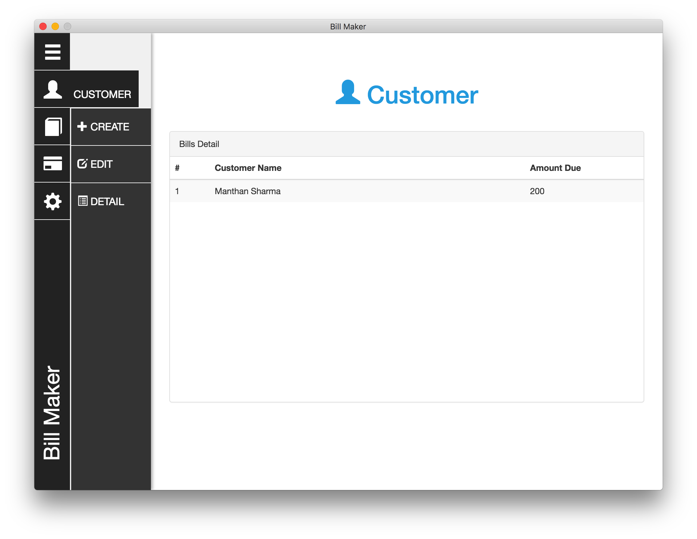

# <a href="http://mongotron.io/" target="_blank">Bill Maker</a>



## Table of Contents

* [Quick start](#quick-start)

### Quick Start

* Clone the repo
* Install dependencies

```shell
npm install
```

* Start the app

```shell
npm electron
```

###Troubleshooting

####electron command not found
If you get this error you don't have Electron installed. Go [here] (https://github.com/atom/electron/blob/master/docs/tutorial/quick-start.md) to install it.
